# Agentic Context Engine (ACE) 


[](https://discord.gg/mqCqH7sTyK)
[](https://twitter.com/kaybaai)
[](https://badge.fury.io/py/ace-framework)
[](https://www.python.org/downloads/)


**AI agents that get smarter with every task 🧠**

Agentic Context Engine learns from your agent's successes and failures. Just plug in and watch your agents improve.

Star ⭐️ this repo if you find it useful!

---

## 🤖 LLM Quickstart
1. Direct your favorite coding agent (Cursor, Claude Code, Codex, etc) to [Agents.md](https://github.com/kayba-ai/agentic-context-engine/blob/main/Agents.md?plain=1)
2. Prompt away!

---

## ✋ Quick Start

### 1. Install

```bash
pip install ace-framework
```

### 2. Set Your API Key

```bash
export OPENAI_API_KEY="your-api-key"
# Or use Claude, Gemini, or 100+ other providers
```

### 3. Create Your First ACE Agent

```python
from ace import LiteLLMClient, Generator, Reflector, Curator, Playbook

# Initialize with any LLM
client = LiteLLMClient(model="gpt-4o-mini")
generator = Generator(client)
reflector = Reflector(client)
curator = Curator(client)
playbook = Playbook()

# Teach your agent through examples
# (See examples/ folder for complete training patterns)

# Now it can solve new problems with learned strategies
result = generator.generate(
    question="Give me the seahorse emoji",
    context="",
    playbook=playbook
)
print(result.final_answer)  # Agent applies learned strategies
```

That's it! Your agent is now learning and improving. 🎉

---

## Why Agentic Context Engine (ACE)?

AI agents make the same mistakes repeatedly.

ACE enables agents to learn from execution feedback: what works, what doesn't, and continuously improve. <br> No training data, no fine-tuning, just automatic improvement.

### Clear Benefits
- 📈 **20-35% Better Performance**: Proven improvements on complex tasks
- 🧠 **Self-Improving**: Agents get smarter with each task
- 🔄 **No Context Collapse**: Preserves valuable knowledge over time
- 🚀 **100+ LLM Providers**: Works with OpenAI, Anthropic, Google, and more
- 📊 **Production Observability**: Built-in Opik integration for enterprise monitoring

---

## Demos

### 🌊 The Seahorse Emoji Challenge

A challenge where LLMs often hallucinate that a seahorse emoji exists (it doesn't).
Watch ACE learn from its own mistakes in real-time. This demo shows how ACE handles the infamous challenge!


In this example:
- **Round 1**: The agent incorrectly outputs 🐴 (horse emoji)
- **Self-Reflection**: ACE reflects without any external feedback
- **Round 2**: With learned strategies from ACE, the agent successfully realizes there is no seahorse emoji

Try it yourself:
```bash
python examples/kayba_ace_test.py
```

---

## How does Agentic Context Engine (ACE) work?

*Based on the [ACE research framework](https://arxiv.org/abs/2510.04618) from Stanford & SambaNova.*

ACE uses three specialized roles that work together:
1. **🎯 Generator** - Executes tasks using learned strategies from the playbook
2. **🔍 Reflector** - Analyzes what worked and what didn't after each execution
3. **📝 Curator** - Updates the playbook with new strategies based on reflection

ACE teaches your agent and internalises:
- **✅ Successes** → Extract patterns that work
- **❌ Failures** → Learn what to avoid
- **🔧 Tool usage** → Discover which tools work best for which tasks
- **🎯 Edge cases** → Remember rare scenarios and how to handle them

The magic happens in the **Playbook**—a living document of strategies that evolves with experience. <br>
**Key innovation:** All learning happens **in context** through incremental updates—no fine-tuning, no training data, and complete transparency into what your agent learned.

```mermaid
---
config:
  look: neo
  theme: neutral
---
flowchart LR
    Playbook[("`**📚 Playbook**<br>(Evolving Context)<br><br>•Strategy Bullets<br> ✓ Helpful strategies <br>✗ Harmful patterns <br>○ Neutral observations`")]
    Start(["**📝Query** <br>User prompt or question"]) --> Generator["**⚙️Generator** <br>Executes task using playbook"]
    Generator --> Reflector
    Playbook -. Provides Context .-> Generator
    Environment["**🌍 Task Environment**<br>Evaluates answer<br>Provides feedback"] -- Feedback+ <br>Optional Ground Truth --> Reflector
    Reflector["**🔍 Reflector**<br>Analyzes and provides feedback what was helpful/harmful"]
    Reflector --> Curator["**📝 Curator**<br>Produces improvement deltas"]
    Curator --> DeltaOps["**🔀Merger** <br>Updates the playbook with deltas"]
    DeltaOps -- Incremental<br>Updates --> Playbook
    Generator <--> Environment
```



---

## Installation Options

```bash
# Basic installation
pip install ace-framework

# With demo support (browser automation)
pip install ace-framework[demos]

# With LangChain support
pip install ace-framework[langchain]

# With local model support
pip install ace-framework[transformers]

# With all features
pip install ace-framework[all]

# Development
pip install ace-framework[dev]

# Development from source (contributors) - UV Method (10-100x faster)
git clone https://github.com/kayba-ai/agentic-context-engine
cd agentic-context-engine
uv sync

# Development from source (contributors) - Traditional Method
git clone https://github.com/kayba-ai/agentic-context-engine
cd agentic-context-engine
pip install -e .
```

## Configuration

ACE works with any LLM provider through LiteLLM:

```python
# OpenAI
client = LiteLLMClient(model="gpt-4o")

# Anthropic Claude
client = LiteLLMClient(model="claude-3-5-sonnet-20241022")

# Google Gemini
client = LiteLLMClient(model="gemini-pro")

# Ollama (local)
client = LiteLLMClient(model="ollama/llama2")

# With fallbacks for reliability
client = LiteLLMClient(
    model="gpt-4",
    fallbacks=["claude-3-haiku", "gpt-3.5-turbo"]
)
```

### Observability with Opik

ACE includes built-in Opik integration for production monitoring and debugging.

#### Quick Start
```bash
# Install with Opik support
pip install ace-framework opik

# Set your Opik API key (or use local deployment)
export OPIK_API_KEY="your-api-key"
export OPIK_PROJECT_NAME="ace-project"
```

#### What Gets Tracked
When Opik is available, ACE automatically logs:
- **Generator**: Input questions, reasoning, and final answers
- **Reflector**: Error analysis and bullet classifications
- **Curator**: Playbook updates and delta operations
- **Playbook Evolution**: Changes to strategies over time

#### Viewing Traces
```python
# Opik tracing is automatic - just run your ACE code normally
from ace import Generator, Reflector, Curator, Playbook
from ace.llm_providers import LiteLLMClient

# All role interactions are automatically tracked
generator = Generator(llm_client)
output = generator.generate(
    question="What is 2+2?",
    context="Show your work",
    playbook=playbook
)
# View traces at https://www.comet.com/opik or your local Opik instance
```

#### Graceful Degradation
If Opik is not installed or configured, ACE continues to work normally without tracing. No code changes needed.

---

## 📊 Benchmarks

Evaluate ACE performance with scientific rigor using our comprehensive benchmark suite.

### Quick Benchmark

```bash
# Compare baseline vs ACE on any benchmark
uv run python scripts/run_benchmark.py simple_qa --limit 50 --compare

# Run with proper train/test split (prevents overfitting)
uv run python scripts/run_benchmark.py finer_ord --limit 100

# Baseline evaluation (no ACE learning)
uv run python scripts/run_benchmark.py hellaswag --limit 50 --skip-adaptation
```

### Available Benchmarks

| Benchmark | Description | Domain |
|-----------|-------------|---------|
| **simple_qa** | Question Answering (SQuAD) | General |
| **finer_ord** | Financial Named Entity Recognition | Finance |
| **mmlu** | Massive Multitask Language Understanding | General Knowledge |
| **hellaswag** | Commonsense Reasoning | Common Sense |
| **arc_easy/arc_challenge** | AI2 Reasoning Challenge | Reasoning |

### Evaluation Modes

- **ACE Mode**: Train/test split with learning (shows true generalization)
- **Baseline Mode**: Direct evaluation without learning (`--skip-adaptation`)
- **Comparison Mode**: Side-by-side baseline vs ACE (`--compare`)

The benchmark system prevents overfitting with automatic 80/20 train/test splits and provides overfitting analysis to ensure honest metrics.

**[→ Full Benchmark Documentation](benchmarks/README.md)**

---

## Documentation

- [Quick Start Guide](docs/QUICK_START.md) - Get running in 5 minutes
- [API Reference](docs/API_REFERENCE.md) - Complete API documentation
- [Examples](examples/) - Ready-to-run code examples
- [ACE Framework Guide](docs/COMPLETE_GUIDE_TO_ACE.md) - Deep dive into Agentic Context Engineering
- [Prompt Engineering](docs/PROMPT_ENGINEERING.md) - Advanced prompt techniques
- [Changelog](CHANGELOG.md) - See recent changes

---

## Contributing

We love contributions! Check out our [Contributing Guide](CONTRIBUTING.md) to get started.

---

## Acknowledgment

Based on the [ACE paper](https://arxiv.org/abs/2510.04618) and inspired by [Dynamic Cheatsheet](https://arxiv.org/abs/2504.07952).

If you use ACE in your research, please cite:
```bibtex
@article{zhang2024ace,title={Agentic Context Engineering},author={Zhang et al.},journal={arXiv:2510.04618},year={2024}}
```


<div align="center">

<br>

**⭐ Star this repo if you find it useful!** <br>
**Built with ❤️ by [Kayba](https://kayba.ai) and the open-source community.**

</div>
